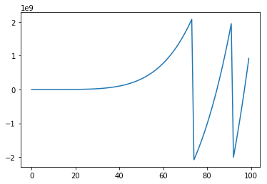

```python
a = 5
b = 5
c = a+b
print(c)
```

    10
    


```python
name = 'nabil'
name
```


    'nabil'


```python
import numpy as np
import matplotlib.pyplot as mp

x = np.arange(100);
y = x*x*x*x*x;
mp.plot(x,y)
mp.show()
y
```





    array([          0,           1,          32,         243,        1024,
                  3125,        7776,       16807,       32768,       59049,
                100000,      161051,      248832,      371293,      537824,
                759375,     1048576,     1419857,     1889568,     2476099,
               3200000,     4084101,     5153632,     6436343,     7962624,
               9765625,    11881376,    14348907,    17210368,    20511149,
              24300000,    28629151,    33554432,    39135393,    45435424,
              52521875,    60466176,    69343957,    79235168,    90224199,
             102400000,   115856201,   130691232,   147008443,   164916224,
             184528125,   205962976,   229345007,   254803968,   282475249,
             312500000,   345025251,   380204032,   418195493,   459165024,
             503284375,   550731776,   601692057,   656356768,   714924299,
             777600000,   844596301,   916132832,   992436543,  1073741824,
            1160290625,  1252332576,  1350125107,  1453933568,  1564031349,
            1680700000,  1804229351,  1934917632,  2073071593, -2075960672,
           -1921920421, -1759441920, -1588183139, -1407792928, -1217910897,
           -1018167296,  -808182895,  -587568864,  -355926653,  -112847872,
             142085829,   409302880,   689241911,   982351872,  1289092153,
            1609932704,  1945354155, -1999119360, -1633050899, -1250894368,
            -852125217,  -436207616,    -2594335,   449273376,   919965907])


```python
! python --version

```

    Python 3.6.1 :: Anaconda 4.4.0 (64-bit)
    


```python
! cd
```

    A:\Jupyter Notebook Test
    


```python

```
